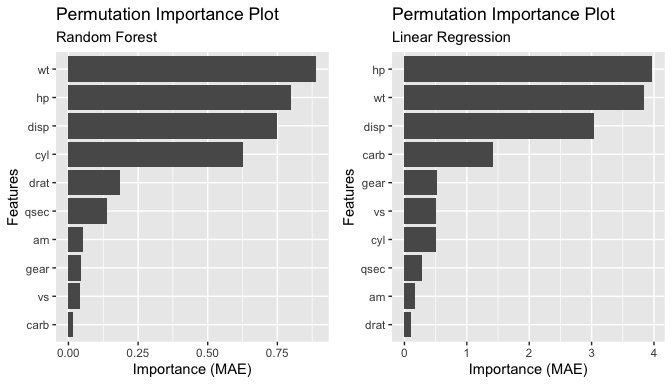
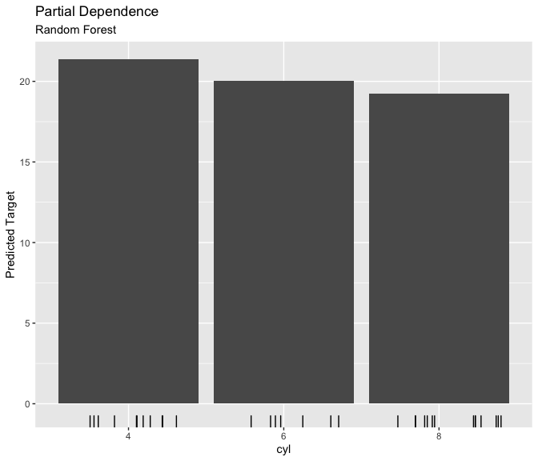

<!-- README.md is generated from README.Rmd. Please edit that file -->

# xrayspecs

<!-- badges: start -->

<!-- badges: end -->

The `xrayspecs` package provides model-agnostic interpretations of
black-box models. The package is designed to integrate into the
`parsnip` package’s unified modelling framework.

## Installation

You cannot currently install xrayspecs from
[CRAN](https://CRAN.R-project.org). However, you can install the
development version from [GitHub](https://github.com/) with:

``` r
# install.packages("devtools")
devtools::install_github("mt-edwards/xrayspecs")
```

## Example

``` r
library(xrayspecs)
```

### Data Set

The `mtcars` data set is used for this example. The `dplyr` package is
used to transform the categorical features (`cyl`, `vs`, `am`, `gear`
and `carb`) to factors. These trasformations are required so that the
`dependence_plot` function knows how to plot the feature predictions.
For example, the predictions of continuous features are displayed with
line plots and the predictions of categorical features are displayed
with bar plots.

``` r
library(dplyr)

mtcars <- mtcars %>% 
  mutate(
    cyl = factor(cyl),
    vs = factor(vs),
    am = factor(am),
    gear = factor(gear),
    carb = factor(carb)
  )
```

### Random Forest and Linear Regression Models

A [random forest](https://en.wikipedia.org/wiki/Random_forest) and a
[linear regression](https://en.wikipedia.org/wiki/Linear_regression)
model are fit to the `mtcars` data set using the `parsnip` package. The
`parsnip` package provides a unified framework for fitting models in
`R`. The models that are available for fitting in `parsnip` are listed
[here](https://tidymodels.github.io/parsnip/articles/articles/Models.html).
The `xrayspecs` package is designed to integrate into the `parsnip`
package’s unified framework.

``` r
library(parsnip)

# Random forest
rf <- rand_forest(mode = "regression") %>% 
  set_engine("ranger") %>% 
  fit(mpg ~ ., data = mtcars)

# Linear regression
lr <- linear_reg() %>% 
  set_engine("lm") %>% 
  fit(mpg ~ ., data = mtcars)
```

### Permutation Importance Plot

To display a [permutation
importance](https://christophm.github.io/interpretable-ml-book/feature-importance.html)
plot of the random forest and linear regression features all you need to
do is pipe the `rf` and `lr` objects into the `plot_importance` function
along with the data (`mtcars`) the target (`mpg`) and a metric from the
`yardstick` package, e.g. `mae` (Mean Absolute Error). Multiple plots
are displayed using the `cowplot` package. A feature importance is equal
to the absolute difference between the metric estimates when the feature
is and is not permuted in the data. **Note**: metrics must be
appropriate for the target variable.

``` r
library(yardstick)
library(cowplot)

# Random forest
p1 <- rf %>% 
  plot_importance(mtcars, mpg, mae) +
  labs(subtitle = "Random Forest")

# Linear regression
p2 <- lr %>% 
  plot_importance(mtcars, mpg, mae) +
  labs(subtitle = "Linear Regression")

plot_grid(p1, p2)
```



### Partial Dependence Plot

To display a [partial
dependence](https://christophm.github.io/interpretable-ml-book/pdp.html)
plot of a feature for the random forest and linear regression models all
you need to do is pipe the `rf` and `lr` objects into the
`dependence_plot` function along with the data (`mtcars`) and the
feature. Here the partial dependence plots of the most “important”
continuous and categorical features (`wt` and `cyl`) are displayed.

``` r
# Random forest
p1 <- rf %>% 
  plot_dependence(mtcars, wt) +
  labs(subtitle = "Random Forest")

# Linear regression
p2 <- lr %>% 
  plot_dependence(mtcars, wt) +
  labs(subtitle = "Linear Regression")

plot_grid(p1, p2)
```


``` r
# Random forest
p1 <- rf %>% 
  plot_dependence(mtcars, cyl) +
  labs(subtitle = "Random Forest")

# Linear regression
p2 <- lr %>% 
  plot_dependence(mtcars, cyl) +
  labs(subtitle = "Linear Regression")

plot_grid(p1, p2)
```


