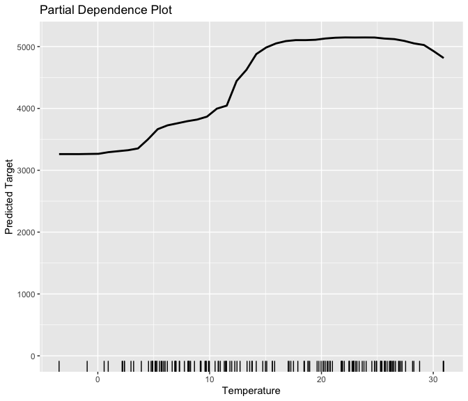
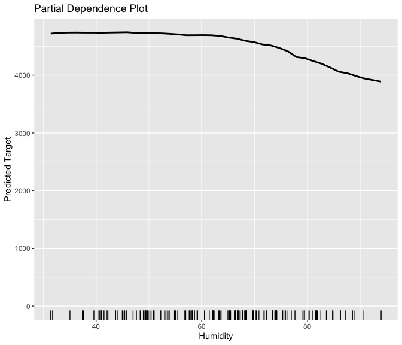
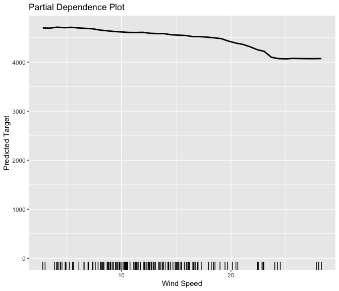
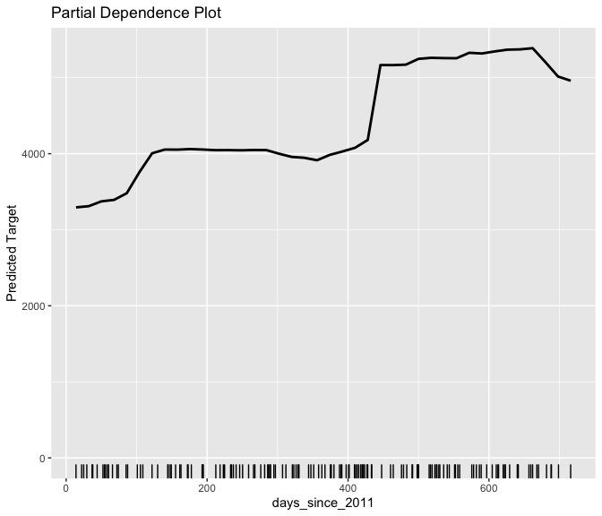
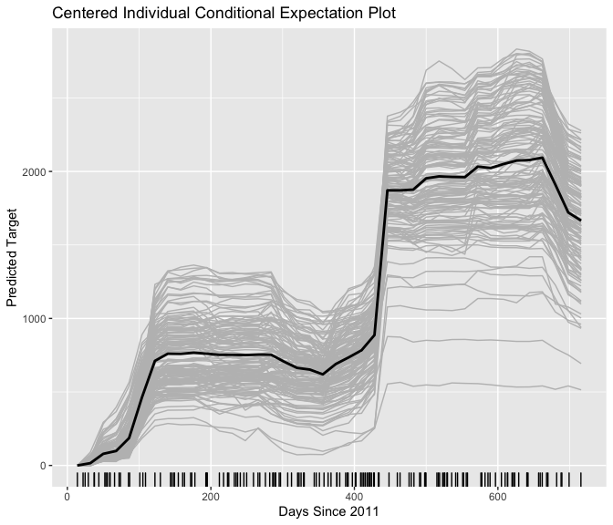

<!-- README.md is generated from README.Rmd. Please edit that file -->

# xrayspecs

<!-- badges: start -->

<!-- badges: end -->

The xrayspecs package provides model-agnostic interpretations of
black-box models. The package is designed to integrate into the
`parsnip` package’s unified modelling framework. Currently the package
supports: permutation importance plots, partial dependence plots and
individual conditional expectation plots.

## Installation

You cannot currently install xrayspecs from
[CRAN](https://CRAN.R-project.org). However, you can install the
development version of xrayspecs from [GitHub](https://github.com/)
with:

``` r
# install.packages("devtools")
devtools::install_github("mt-edwards/xrayspecs")
```

## Example

``` r
library(xrayspecs)
library(tidyverse)
library(tidymodels)
library(ranger)
```

### Data Set

The `bike` data set is used for this example.This data set contains
features only of type double (`<dbl>`) and type factor (`<fct>`). This
is required so that the `plot_dependence()` function knows how to plot
the feature predictions. For example, the predictions of double
(continuous) features are displayed with line plots and the predictions
of factor (categorical) features are displayed with bar plots.

``` r
data("bike")
```

### Training and Testing Split

The `bike` data set set is split into a training set and a test set with
the rsample package. The trainiing set is used to train the predictive
models and the test set is used to test and interpret the predictive
models.

``` r
split <- initial_split(bike, prop = 4 / 5, strata = "bikes_rented")
bike_train <- training(split)
bike_test <- testing(split)
```

### Random Forest Model

A [random forest](https://en.wikipedia.org/wiki/Random_forest) is
trained on the `bike_train` data set using the `parsnip` package. The
`parsnip` package provides a unified framework for fitting models in
`R`. The models that are available for training in `parsnip` are listed
[here](https://tidymodels.github.io/parsnip/articles/articles/Models.html).
The xrayspecs package is designed to integrate into the `parsnip`
package’s unified framework.

``` r
rf <- rand_forest(mode = "regression") %>% 
  set_engine("ranger") %>% 
  fit(bikes_rented ~ ., data = bike_train)
```

### Testing models

``` r
predict(rf, bike_test) %>% 
  bind_cols(bike_test) %>% 
  mae(truth = bikes_rented, estimate = .pred)
#> # A tibble: 1 x 3
#>   .metric .estimator .estimate
#>   <chr>   <chr>          <dbl>
#> 1 mae     standard        461.
```

### Permutation Importance Plot

To display a [permutation
importance](https://christophm.github.io/interpretable-ml-book/feature-importance.html)
plot of the random forest features all you need to do is pipe the `rf`
object into the `plot_importance()` function along with the test data
(`bike_test`) the target (`bike_rentals`) and a metric from the
`yardstick` package, e.g. `mae` (Mean Absolute Error). A feature
importance is equal to the absolute difference between the metric
estimate when the feature is and is not permuted in the data. **Note**:
metrics must be appropriate for the target variable.

``` r
rf %>% 
  plot_importance(bike_test, bikes_rented, mae) +
  labs(title = "Permutation Importance Plot")
```


### Partial Dependence Plot

To display a [partial
dependence](https://christophm.github.io/interpretable-ml-book/pdp.html)
plot of a feature for the random forest model all you need to do is pipe
the `rf` object into the `plot_dependence()` function along with the
data (`bike_test`) and the feature. Here the partial dependence plots of
`temperature`, `humidity` and `wind_speed` are displayed.

``` r
rf %>% 
  plot_dependence(bike_test, temperature) +
  labs(title = "Partial Dependence Plot") +
  labs(x = "Temperature")

rf %>% 
  plot_dependence(bike_test, humidity) +
  labs(title = "Partial Dependence Plot") +
  labs(x = "Humidity")

rf %>% 
  plot_dependence(bike_test, wind_speed) +
  labs(title = "Partial Dependence Plot") +
  labs(x = "Wind Speed")
```



``` r
rf %>% 
  plot_dependence(bike_test, season) +
  labs(title = "Partial Dependence Plot") +
  labs(x = "Season")
```


### Individual Conditional Expectation Plot

To display an [individual conditional
expectation](https://christophm.github.io/interpretable-ml-book/ice.html)
plot of a feature for the random forest model all you need to do is pipe
the `rf` object into the `plot_dependence()` function along with the
data (`bike_test`) and the feature with the optional argument `examples`
assigned to `TRUE`. Individual conditional expectation plots are not
available for features of type factor

``` r
rf %>% 
  plot_dependence(bike_test, days_since_2011) +
  labs(title = "Partial Dependence Plot") +
  labs("Days Since 2011")

rf %>% 
  plot_dependence(bike_test, days_since_2011, examples = TRUE) +
  labs(title = "Individual Conditional Expectation Plot") +
  labs(x = "Days Since 2011")

rf %>% 
  plot_dependence(bike_test, days_since_2011, examples = TRUE, center = TRUE) +
  labs(title = "Centered Individual Conditional Expectation Plot") +
  labs(x = "Days Since 2011")
```


