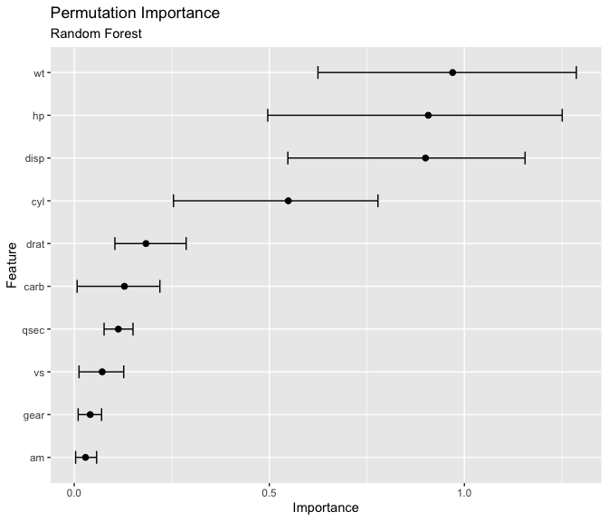

<!-- README.md is generated from README.Rmd. Please edit that file -->

# xrayspecs

<!-- badges: start -->

<!-- badges: end -->

The goal of xrayspecs is to display model-agnostic iterpretations of
black-box models.

## Installation

You cannot currently install xrayspecs from
[CRAN](https://CRAN.R-project.org). However, you can install the
development version from [GitHub](https://github.com/) with:

``` r
# install.packages("devtools")
devtools::install_github("mt-edwards/xrayspecs")
```

## Example

``` r
library(xrayspecs)
```

### Data set

The `mtcars` data set is used for this example. The `dplyr` package is
used to transform the categorical features (`cyl`, `vs`, `am`, `gear`
and `carb`) to factors. The trasformation is required so that the
`effect_plot` function, from the `xrayspecs` package, knows how to plot
the feature effects. For example, the effect of continuous features are
displayed with line plots and the effect of categorical features are
displayed with bar plots.

``` r
library(dplyr)

mtcars <- mtcars %>% 
  mutate(
    cyl = factor(cyl),
    vs = factor(vs),
    am = factor(am),
    gear = factor(gear),
    carb = factor(carb)
  )
```

### Random forest and linear regression models

A [random forest](https://en.wikipedia.org/wiki/Random_forest) and a
[linear regression](https://en.wikipedia.org/wiki/Linear_regression)
model is fit to the `mtcars` data set using the `parsnip` package. The
`parsnip` package provides a unified framework for fitting models in
`R`. The models that are available for fitting in `parsnip` are listed
[here](https://tidymodels.github.io/parsnip/articles/articles/Models.html).
The `xrayspecs` package is designed to integrate into the `parsnip`
package’s unified framework.

``` r
library(parsnip)

# Random forest
rf <- rand_forest(mode = "regression") %>% 
  set_engine("ranger") %>% 
  fit(mpg ~ ., data = mtcars)

# Linear regression
lr <- linear_reg() %>% 
  set_engine("lm") %>% 
  fit(mpg ~ ., data = mtcars)
```

### Permutation importance plot

To display a [permutation
importance](https://christophm.github.io/interpretable-ml-book/feature-importance.html)
plot of the random forest and linear regression features all you need to
do is pipe the `rf` and `lr` objects into the `importance_plot` function
along with the data set (`mtcars`) and the name of the target variable
(`mpg`). Multiple plots are displayed using the `cowplot` package.

``` r
library(cowplot)

p1 <- rf %>% importance_plot(mtcars, mpg) + ggtitle("Random Forest")
p2 <- lr %>% importance_plot(mtcars, mpg) + ggtitle("Linear Regression")
plot_grid(p1, p2)
```



### Partial dependence effect plot

To display a [partial dependence
effect](https://christophm.github.io/interpretable-ml-book/pdp.html)
plot of a random forest feature all you need to do is pipe the `rf`
object into the `effect_plot` function along with the data set
(`mtcars`) and the name of the feature. Here the `purrr` and `cowplot`
packages are used to display for effect plots for the four most
“important” features (`disp`, `wt`, `hp` and `cyl`)

``` r
library(purrr)

feature_names <- c("wt", "disp", "hp", "cyl")
rf_plots <- map(feature_names, effect_plot, object = rf, new_data = mtcars)
plot_grid(plotlist = rf_plots)
```


Note that effect of the `disp` variable is reversed in the linear
regression model. This is because the random forest captures
interactions between the features of the model whereas the linear
regression model does
not.

``` r
lr_plots <- map(feature_names, effect_plot, object = lr, new_data = mtcars)
plot_grid(plotlist = lr_plots)
```


